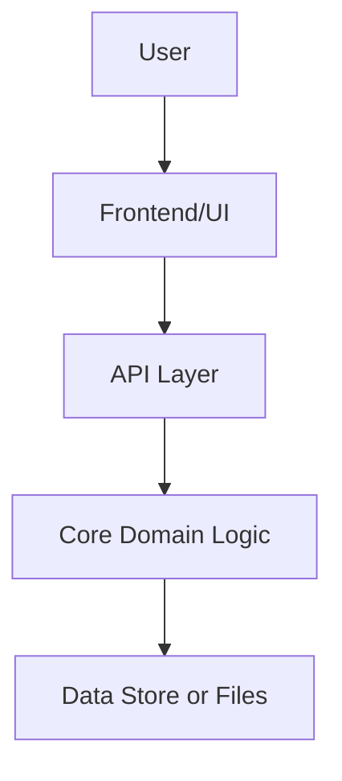

# Repo Knowledge Base Skill

You are building a durable, repo-local knowledge base that helps humans and future agents understand the repository in detail.

The goal is not a shallow README rewrite. The goal is a reusable, evidence-based repo wiki that explains how the project works, why files exist, how pieces connect, what is risky, what is missing, and where future agents should start.

This skill is optimized for:

- GitHub Copilot Cloud Agent sessions.
- GitHub Copilot CLI sessions.
- VS Code agent mode.
- Future agents that need durable repo context across sessions.

## Activation Triggers

Use this skill when the user asks for any of the following:

- Build a knowledge base for this repo.
- Document the whole repo.
- Explain every part of the repository.
- Create a repo wiki.
- Map the architecture.
- Make the repo understandable for Copilot or future agents.
- Audit the repo structure.
- Generate docs from the codebase.
- Create onboarding docs.
- Preserve repo knowledge across Copilot Cloud Agent sessions.
- Make the project easier for Copilot CLI to work on.
- Create Copilot instructions for using repo docs.
- Create agent instructions for maintaining repo knowledge.

## Core Principle

Treat the repository as raw source material and compile it into a structured Markdown knowledge base.

Do not rely on memory, guesses, or generic framework assumptions. Every claim should be grounded in files, commands, symbols, scripts, configs, tests, or package metadata found in the repo.

Prefer durable Markdown pages over one-off chat answers.

The source code is always the final authority. If the knowledge base and the source code disagree, trust the source code and update the knowledge base.

## Session Optimization Rules

Copilot Cloud Agent sessions and Copilot CLI sessions can be time-limited and context-limited. Work in resumable passes.

### Always Make the Work Resumable

Create or update these files first:

```txt
docs/repo-kb/_state/progress.md
docs/repo-kb/_state/coverage.md
docs/repo-kb/_state/session-log.md
docs/repo-kb/_state/unknowns.md
docs/repo-kb/_state/command-log.md
```

Use them to record:

- What was scanned.
- What was documented.
- What remains.
- Important discoveries.
- Commands run.
- Any failures or skipped areas.
- Recommended next pass.

Never leave the repo knowledge base in a mysterious half-finished state. Leave breadcrumbs like a responsible little code raccoon.

### Use Progressive Scanning

Do not read every file into context at once.

Use this order:

1. Repo inventory.
2. Root-level docs and configs.
3. Package/build/test/deploy files.
4. Source tree structure.
5. Entry points.
6. Core modules.
7. Feature areas.
8. Tests.
9. CI/CD and automation.
10. Generated docs and maintenance pass.
11. Copilot and agent instruction files.

### Avoid Context Explosions

Do not paste huge files into the response or into generated docs.

Summarize large files by:

- Purpose.
- Exports/classes/functions.
- Key dependencies.
- Inputs/outputs.
- Side effects.
- Related tests.
- Related docs.
- Evidence path.

For lockfiles, generated bundles, minified files, vendored code, build artifacts, and binary assets: document their existence and role, but do not analyze line-by-line unless the user specifically asks.

### Do Not Invent

If something is unclear, write it as an open question in:

```txt
docs/repo-kb/questions/
```

or under:

```txt
docs/repo-kb/_state/unknowns.md
```

Use wording like:

```md
## Question: Short title

Status: Unknown from current repo scan.

Evidence checked:
- `path/to/file`
- `path/to/other-file`

Next step:
- Inspect runtime behavior, tests, issue history, or ask the maintainer.
```

## Default Output Structure

Create this structure unless the user specifies a different docs path:

```txt
docs/repo-kb/
  index.md
  repo-map.md
  architecture.md
  quickstart-for-agents.md
  glossary.md
  dependency-map.md
  data-flow.md
  testing.md
  build-and-release.md
  configuration.md
  security-and-risk.md
  maintenance-guide.md

  features/
    index.md

  components/
    index.md

  apis/
    index.md

  data/
    index.md

  workflows/
    index.md

  decisions/
    index.md

  questions/
    index.md

  files/
    index.md

  _state/
    progress.md
    coverage.md
    session-log.md
    unknowns.md
    command-log.md
```

For very small repos, keep fewer pages but preserve the same concepts.

For large repos or monorepos, create additional pages by package, app, service, module, or workspace.

## First Pass: Repository Inventory

Start from the repo root.

Run safe read-only commands where available:

```bash
pwd
git rev-parse --show-toplevel
git status --short
git branch --show-current
git ls-files
```

Then inspect tree shape with commands such as:

```bash
find . -maxdepth 3 -type f \
  -not -path './.git/*' \
  -not -path './node_modules/*' \
  -not -path './vendor/*' \
  -not -path './dist/*' \
  -not -path './build/*'

find . -maxdepth 3 -type d \
  -not -path './.git/*' \
  -not -path './node_modules/*' \
  -not -path './vendor/*'
```

If `rg` is available, use:

```bash
rg --files
```

Look specifically for:

```txt
README*
AGENTS.md
CLAUDE.md
CONTRIBUTING*
LICENSE*
CHANGELOG*
SECURITY*
CODE_OF_CONDUCT*
package.json
bun.lock
pnpm-lock.yaml
yarn.lock
package-lock.json
tsconfig*.json
vite.config.*
next.config.*
astro.config.*
svelte.config.*
tailwind.config.*
eslint.config.*
biome.json*
deno.json*
pyproject.toml
requirements*.txt
uv.lock
Pipfile
poetry.lock
Cargo.toml
go.mod
composer.json
Gemfile
Dockerfile
docker-compose*
compose*
Makefile
justfile
Taskfile*
.github/workflows/*
.github/copilot-instructions.md
.github/instructions/*
.github/skills/*
.env.example
*.schema.*
openapi.*
```

Record inventory results in:

```txt
docs/repo-kb/repo-map.md
docs/repo-kb/_state/coverage.md
```

## Second Pass: Project Identity

Create or update:

```txt
docs/repo-kb/index.md
```

It must answer:

- What is this repo?
- What does it build?
- Who is it for?
- What are the major apps/packages/services?
- What are the main technologies?
- What are the main commands?
- Where should a human start?
- Where should an agent start?
- What is documented so far?
- What is not yet documented?

Use this template:

```md
# Repository Knowledge Base

## Project Summary

Short explanation of what this repository appears to do.

## Main Technologies

| Area | Evidence | Notes |
|---|---|---|
| Runtime | `path/to/file` | ... |
| Framework | `path/to/file` | ... |
| Build system | `path/to/file` | ... |
| Test system | `path/to/file` | ... |

## Start Here

1. [Quickstart for Agents](./quickstart-for-agents.md)
2. [Repo Map](./repo-map.md)
3. [Architecture](./architecture.md)
4. [Configuration](./configuration.md)
5. [Testing](./testing.md)

## Current Coverage

Link to `_state/coverage.md`.

## Open Questions

Link to `questions/index.md`.
```

## Third Pass: Architecture

Create or update:

```txt
docs/repo-kb/architecture.md
```

Cover:

- Runtime architecture.
- App/package boundaries.
- Entry points.
- Major modules.
- Control flow.
- Data flow.
- External services.
- Build-time vs runtime behavior.
- Where state lives.
- Where configuration enters.
- Where errors/logging are handled.
- Where authentication/authorization lives, if present.
- Where API contracts live, if present.
- Where UI routes/components live, if present.
- Where tests verify behavior.

Use Mermaid diagrams when useful, but keep them simple and valid.

Example:

````md

````

Do not create diagrams that claim relationships without evidence.

## Fourth Pass: File and Module Documentation

Create file-level or module-level docs under:

```txt
docs/repo-kb/files/
docs/repo-kb/components/
docs/repo-kb/features/
```

Use this template for important files:

```md
# `path/to/file.ext`

## Purpose

What this file does.

## Why It Matters

Why future maintainers or agents should care.

## Key Symbols

| Symbol | Type | Purpose |
|---|---|---|
| `name` | function/class/component/config | ... |

## Inputs

Files, environment variables, function arguments, API inputs, CLI args, or user actions.

## Outputs

Rendered UI, API responses, files written, database changes, logs, side effects, exports, or build artifacts.

## Internal Dependencies

- `path/to/internal-file`

## External Dependencies

- package/library/tool name

## Related Tests

- `path/to/test`

## Related Docs

- `path/to/doc`

## Risks and Notes

- Things future agents should be careful with.

## Evidence

- `path/to/file.ext`
```

For directories/modules:

```md
# `path/to/module/`

## Responsibility

What this module owns.

## Important Files

| File | Role |
|---|---|
| `file.ext` | ... |

## Public Surface Area

Functions, classes, components, routes, commands, or config exported to the rest of the repo.

## How It Connects

What calls into it and what it calls out to.

## Change Notes for Agents

Rules for modifying this area safely.
```

## Fifth Pass: Features

Create:

```txt
docs/repo-kb/features/index.md
```

Then create one page per feature.

A feature page should include:

```md
# Feature: Name

## User-Facing Behavior

What the feature does from the user's perspective.

## Implementation Map

| Layer | Files |
|---|---|
| UI | ... |
| API | ... |
| State | ... |
| Data | ... |
| Tests | ... |

## Flow

Step-by-step flow through the code.

## Config and Environment

Environment variables, flags, settings, or build options.

## Failure Modes

Known errors or likely failure points.

## How to Modify Safely

Checklist for future agents.

## Evidence

- `path/to/file`
```

## Sixth Pass: Commands and Tooling

Create:

```txt
docs/repo-kb/quickstart-for-agents.md
docs/repo-kb/build-and-release.md
docs/repo-kb/testing.md
```

Extract commands from package files, Makefiles, justfiles, CI workflows, README files, Docker files, and scripts.

Document:

- Install command.
- Dev command.
- Build command.
- Test command.
- Typecheck command.
- Lint command.
- Format command.
- Preview/start command.
- Database/migration commands.
- Deployment commands.
- Known command order.
- Commands that are expensive or unsafe.
- Commands that require secrets.
- Commands that are Cloud Agent safe.
- Commands that are local-only.

Use this table:

```md
| Command | Purpose | Safe in Cloud Agent? | Evidence | Notes |
|---|---|---|---|---|
| `bun install --frozen-lockfile` | Install dependencies | Yes/No/Unknown | `package.json`, `bun.lock` | ... |
```

Do not invent commands. If the repo does not define a command, say so.

## Seventh Pass: Configuration and Secrets

Create:

```txt
docs/repo-kb/configuration.md
```

Document:

- `.env.example`
- config files
- environment variables referenced in code
- required secrets
- optional settings
- default values
- deployment-specific configuration
- local dev configuration
- CI/CD configuration

Use safe handling:

- Never expose real secrets.
- Never print secret values.
- Only document variable names and purpose.
- If a variable appears sensitive, mark it sensitive.

Find env usage with safe searches such as:

```bash
rg "process\.env|import\.meta\.env|Deno\.env|os\.environ|dotenv|ENV\[|getenv|System\.getenv" .
```

## Eighth Pass: APIs, Routes, and Data Contracts

Create:

```txt
docs/repo-kb/apis/index.md
docs/repo-kb/data/index.md
docs/repo-kb/data-flow.md
```

Look for:

- HTTP routes.
- RPC handlers.
- CLI commands.
- WebSocket events.
- database schemas.
- migrations.
- validation schemas.
- TypeScript interfaces/types.
- OpenAPI files.
- GraphQL schemas.
- JSON schemas.
- model definitions.
- serialization/deserialization.

For each API or data contract:

```md
# API or Contract Name

## Location

- `path/to/file`

## Purpose

## Inputs

## Outputs

## Validation

## Auth/Security

## Callers

## Side Effects

## Related Tests

## Evidence
```

## Ninth Pass: CI/CD and Automation

Create:

```txt
docs/repo-kb/workflows/index.md
docs/repo-kb/build-and-release.md
```

Inspect:

```txt
.github/workflows/
.github/actions/
Dockerfile
docker-compose.yml
compose.yml
netlify.toml
vercel.json
render.yaml
fly.toml
railway.json
wrangler.toml
cloudflare*
```

For each workflow:

```md
# Workflow: Name

## File

`path/to/workflow.yml`

## Trigger

## Jobs

## Required Secrets

Names only. Do not expose values.

## Build/Test/Deploy Steps

## Agent Notes

What Copilot Cloud Agent should know before changing this.
```

## Tenth Pass: Security and Risk

Create:

```txt
docs/repo-kb/security-and-risk.md
```

Look for:

- Auth boundaries.
- Token handling.
- File uploads.
- Shell execution.
- Network calls.
- CORS.
- SQL/query construction.
- Dependency risks.
- Public/private data handling.
- Generated code.
- Admin routes.
- Dangerous scripts.
- Destructive commands.
- Missing tests around critical paths.

Use cautious wording. This is not a full security audit unless the user asks. It is a repo knowledge-base risk map.

## Eleventh Pass: Decisions and History

Create:

```txt
docs/repo-kb/decisions/index.md
```

If the repo has ADRs, docs, issues, or commit hints, summarize decisions.

If not, infer only low-risk decisions from current structure and mark them as inferred.

Template:

```md
# Decision: Title

## Status

Known / Inferred / Unknown

## Context

## Decision

## Evidence

## Consequences

## Follow-up Questions
```

## Twelfth Pass: Maintenance

Create:

```txt
docs/repo-kb/maintenance-guide.md
```

Include:

- How to refresh the KB after code changes.
- Which commands to rerun.
- Which docs are generated by agents.
- How to add a new feature page.
- How to update coverage.
- How to file unanswered questions.
- How to avoid stale docs.

## Thirteenth Pass: Copilot Instructions for Using the Knowledge Base

Create or update:

```txt
.github/copilot-instructions.md
.github/instructions/repo-kb.instructions.md
AGENTS.md
```

The repository-wide instructions must tell Copilot Cloud Agent, Copilot CLI, and IDE agent sessions to use `docs/repo-kb/` as the first source of repo context.

The goal is to reduce repeated repo exploration, repeated command discovery, and accidental edits that ignore existing architecture notes.

### Required Behavior

Before making code changes, agents must:

1. Read `docs/repo-kb/index.md`.
2. Read `docs/repo-kb/quickstart-for-agents.md`.
3. Read `docs/repo-kb/architecture.md`.
4. Read the most relevant feature, component, API, workflow, or file page.
5. Check `docs/repo-kb/_state/coverage.md` to understand what is known, partial, or missing.
6. Check `docs/repo-kb/_state/unknowns.md` before assuming undocumented behavior.
7. Search the source only when the knowledge base is missing, stale, unclear, or contradicted by code.

The instructions must also tell agents:

- The source code is the final authority.
- The knowledge base is a navigation and reasoning layer, not a replacement for verification.
- If code and docs disagree, trust code and update the knowledge base.
- After meaningful repo changes, update the relevant `docs/repo-kb/` page.
- After changing commands, tests, workflows, config, dependencies, routes, APIs, or architecture, update the matching KB page and coverage state.
- Do not mark coverage complete unless it is actually complete.
- Do not invent undocumented behavior.
- Preserve open questions in `docs/repo-kb/questions/` or `_state/unknowns.md`.

## Generated File: `.github/copilot-instructions.md`

Create this file if it does not exist. If it already exists, merge these instructions without deleting existing project rules.

````md
# Copilot Repository Instructions

This repository has a durable knowledge base in `docs/repo-kb/`.

Use the knowledge base before broad repo exploration. It exists to help Copilot Cloud Agent, Copilot CLI, and IDE agent sessions work faster, avoid repeated discovery, and preserve project context across sessions.

## Start Here

Before making non-trivial changes, read these files in order:

1. `docs/repo-kb/index.md`
2. `docs/repo-kb/quickstart-for-agents.md`
3. `docs/repo-kb/architecture.md`
4. `docs/repo-kb/repo-map.md`
5. `docs/repo-kb/_state/coverage.md`
6. `docs/repo-kb/_state/unknowns.md`

Then read any relevant pages under:

- `docs/repo-kb/features/`
- `docs/repo-kb/components/`
- `docs/repo-kb/apis/`
- `docs/repo-kb/data/`
- `docs/repo-kb/workflows/`
- `docs/repo-kb/files/`

## How to Use the Knowledge Base

Use `docs/repo-kb/` as the first navigation layer for the repo.

Prefer the KB for:

- Project summary and architecture.
- Where files and features live.
- Safe build, test, lint, and validation commands.
- Configuration and environment variable notes.
- CI/CD and workflow behavior.
- Known risks and fragile areas.
- Prior session findings.
- Known unknowns and incomplete coverage.

Use source files for final verification.

The source code is the final authority. If the KB conflicts with the source, trust the source and update the KB.

## When to Search the Repo

Search the source when:

- The KB is missing the area you need.
- The KB marks the area as partial or unknown.
- The KB appears stale.
- You are about to change behavior and need exact implementation details.
- Tests, commands, or workflows fail in a way not covered by the KB.

Avoid broad repeated repo scans when the KB already answers the question.

## Updating the Knowledge Base

After meaningful changes, update the KB in the same pull request.

Always update the KB when changing:

- Architecture or module boundaries.
- Build, test, lint, or dev commands.
- Package manager or dependency setup.
- GitHub Actions or deployment workflows.
- Environment variables or config files.
- API routes, schemas, data contracts, or migrations.
- User-facing features.
- Security-sensitive behavior.
- Known risks, workarounds, or failure modes.

Update these state files when relevant:

- `docs/repo-kb/_state/coverage.md`
- `docs/repo-kb/_state/session-log.md`
- `docs/repo-kb/_state/unknowns.md`
- `docs/repo-kb/_state/command-log.md`

Do not mark coverage complete unless it is actually complete.

## Handling Unknowns

Do not invent behavior.

If something is unclear, document it in:

- `docs/repo-kb/_state/unknowns.md`, or
- a focused page under `docs/repo-kb/questions/`

Use this format:

```md
## Question: Short title

Status: Unknown from current repo scan.

Evidence checked:
- `path/to/file`
- `path/to/other-file`

Next step:
- Inspect runtime behavior, tests, issue history, or ask the maintainer.
```

## Validation

Before finishing code changes, use the commands documented in:

- `docs/repo-kb/quickstart-for-agents.md`
- `docs/repo-kb/testing.md`
- `docs/repo-kb/build-and-release.md`

If documented commands fail, record:

- The command.
- The failure.
- The likely cause.
- Any workaround.
- Whether the failure is pre-existing.

Update `docs/repo-kb/_state/command-log.md` when command behavior changes.

## Agent Session Hygiene

At the end of a Copilot Cloud Agent or Copilot CLI session, leave a short note in:

```txt
docs/repo-kb/_state/session-log.md
```

Include:

- What changed.
- What was validated.
- What failed.
- What remains.
- What a future agent should do next.

Keep the repo knowledge base useful, current, and boring in the best possible way.
````

## Generated File: `.github/instructions/repo-kb.instructions.md`

Create this file to guide edits inside the knowledge base itself.

````md
---
applyTo: "docs/repo-kb/**"
---

# Repo Knowledge Base Editing Instructions

These files are the repository knowledge base.

Keep them factual, grounded, and useful for future Copilot Cloud Agent, Copilot CLI, and IDE agent sessions.

## Rules

- Do not invent implementation details.
- Prefer links to exact repo paths.
- Keep pages skimmable.
- Update `_state/coverage.md` when coverage changes.
- Update `_state/session-log.md` after meaningful documentation work.
- Put uncertain findings in `_state/unknowns.md` or `questions/`.
- If code and docs disagree, update the docs to match the code.
- Do not paste huge source files into docs.
- Summarize large files by purpose, key symbols, inputs, outputs, dependencies, tests, and risks.
- Preserve command results, failures, and workarounds in `_state/command-log.md`.

## Page Quality Checklist

A good KB page answers:

- What is this?
- Why does it matter?
- Where is the source?
- What depends on it?
- What does it depend on?
- How do you test or validate it?
- What should future agents avoid breaking?
- What is still unknown?
````

## Generated File: `AGENTS.md`

Create this when the repo does not already have one. If it exists, merge the knowledge-base guidance into it.

````md
# Agent Instructions

This repository uses `docs/repo-kb/` as its durable knowledge base.

Before making non-trivial changes, read:

1. `docs/repo-kb/index.md`
2. `docs/repo-kb/quickstart-for-agents.md`
3. `docs/repo-kb/architecture.md`
4. `docs/repo-kb/_state/coverage.md`
5. `docs/repo-kb/_state/unknowns.md`

Use the knowledge base to find the right files, commands, risks, and validation steps before searching broadly.

The source code is the final authority. If the knowledge base is stale or incomplete, update it in the same change.

At the end of a meaningful agent session, append a short note to:

```txt
docs/repo-kb/_state/session-log.md
```

Include what changed, what was validated, what failed, and what future agents should do next.
````

## Coverage Tracking

Maintain:

```txt
docs/repo-kb/_state/coverage.md
```

Use this format:

```md
# Knowledge Base Coverage

## Summary

| Area | Status | Notes |
|---|---|---|
| Root docs | Complete/Partial/Missing | ... |
| Build tooling | Complete/Partial/Missing | ... |
| Source entrypoints | Complete/Partial/Missing | ... |
| Features | Complete/Partial/Missing | ... |
| Tests | Complete/Partial/Missing | ... |
| CI/CD | Complete/Partial/Missing | ... |
| Config/env | Complete/Partial/Missing | ... |
| APIs/contracts | Complete/Partial/Missing | ... |
| Security/risk | Complete/Partial/Missing | ... |
| Copilot instructions | Complete/Partial/Missing | ... |
| Agent instructions | Complete/Partial/Missing | ... |

## Files Scanned

| Path | Status | Notes |
|---|---|---|
| `path` | Scanned/Summarized/Skipped | ... |

## Skipped Files

| Path | Reason |
|---|---|
| `bun.lock` | Lockfile; summarized only |

## Instruction Files

| File | Status | Purpose |
|---|---|---|
| `.github/copilot-instructions.md` | Present/Missing/Updated | Repo-wide Copilot instructions |
| `.github/instructions/repo-kb.instructions.md` | Present/Missing/Updated | Path-specific KB editing instructions |
| `AGENTS.md` | Present/Missing/Updated | Agent instructions for CLI and other agents |

## Next Pass

Prioritized checklist.
```

## Session Log

Maintain:

```txt
docs/repo-kb/_state/session-log.md
```

Append:

```md
## YYYY-MM-DD HH:MM Session

### Goal

### Commands Run

### Files Read

### Files Created or Updated

### Key Findings

### Problems

### Next Recommended Action
```

## Command Log

Maintain:

```txt
docs/repo-kb/_state/command-log.md
```

Use this format:

```md
# Command Log

## Command: `command here`

### Purpose

### Result

Passed / Failed / Skipped / Unknown

### Environment

Copilot Cloud Agent / Copilot CLI / Local / CI

### Notes

### Evidence

- `path/to/file`
```

## Quality Bar

A good repo knowledge base should let a future agent answer:

- Where do I start?
- What commands are safe to run?
- What does each major folder do?
- What files are risky to modify?
- What tests cover this area?
- What feature owns this code?
- Where is configuration defined?
- Where are secrets expected?
- How does data move through the system?
- How does the project build and deploy?
- What docs are stale or missing?
- What should I inspect before editing?
- How should Copilot use the knowledge base before making changes?

## Final Response Requirements

When finishing a session, summarize:

1. What was created or updated.
2. Current coverage level.
3. Most important discoveries.
4. Any uncertain areas.
5. Whether these files were created or updated:
   - `.github/copilot-instructions.md`
   - `.github/instructions/repo-kb.instructions.md`
   - `AGENTS.md`
   - `docs/repo-kb/_state/coverage.md`
   - `docs/repo-kb/_state/session-log.md`
6. Exact next steps for a future Copilot Cloud Agent or Copilot CLI session.

Keep the final response short unless the user asks for detail. The durable knowledge should live in the repo, not only in chat.

## Hard Rules

- Do not delete user files.
- Do not expose secrets.
- Do not invent architecture.
- Do not claim full coverage unless coverage is actually tracked.
- Do not run destructive commands.
- Do not install global tools unless necessary and approved by repo conventions.
- Do not rewrite project code unless the user explicitly asks.
- Prefer Markdown docs and small focused commits.
- Prefer resumable progress over one huge fragile pass.
- Preserve useful uncertainty as documented questions.
- Preserve existing `.github/copilot-instructions.md`, `.github/instructions/*.instructions.md`, and `AGENTS.md` content when adding knowledge-base guidance.

## Recommended User Prompts

Use this prompt for a normal repo:

```txt
Use the repo-knowledge-base skill. Build or refresh docs/repo-kb, then create or update .github/copilot-instructions.md, .github/instructions/repo-kb.instructions.md, and AGENTS.md so Copilot Cloud Agent, Copilot CLI, and future agents know to use docs/repo-kb before broad repo exploration. Preserve existing instructions, do not invent project details, and update coverage/session state.
```

Use this prompt for a huge repo:

```txt
Use the repo-knowledge-base skill. Start pass 1 only: create docs/repo-kb, inventory the repo, document the root architecture, commands, tooling, CI/CD, and coverage state. Then create or update .github/copilot-instructions.md, .github/instructions/repo-kb.instructions.md, and AGENTS.md so future agents know how to use the knowledge base. Do not attempt full file-by-file documentation yet. Leave a clear next-pass checklist.
```

Use this prompt for a refresh:

```txt
Use the repo-knowledge-base skill. Refresh docs/repo-kb against the current source code. Check for stale architecture notes, commands, config, tests, CI/CD workflows, APIs, and feature docs. Update .github/copilot-instructions.md, .github/instructions/repo-kb.instructions.md, and AGENTS.md only if needed. Record changes in coverage and session-log.
```
