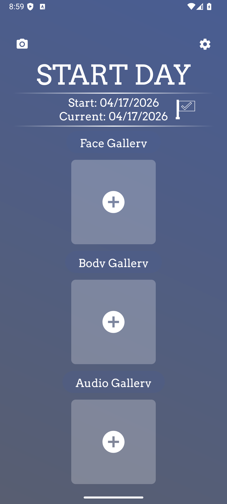
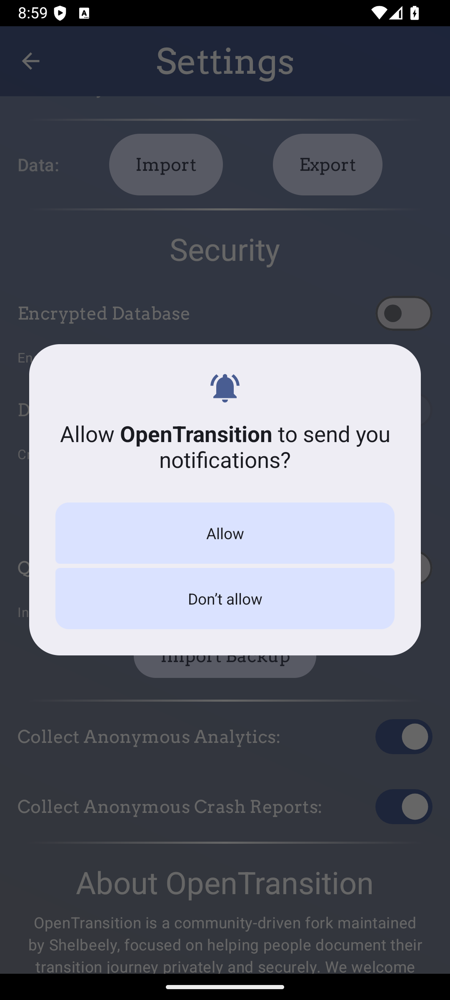
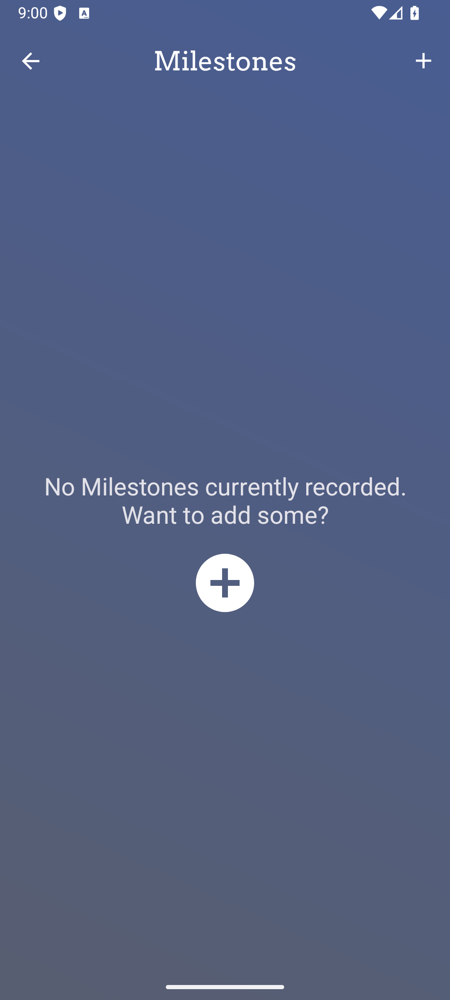
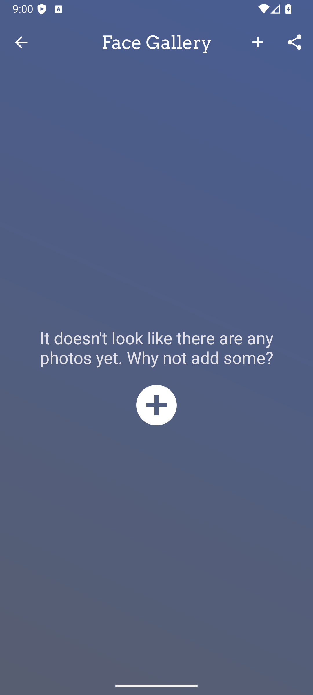
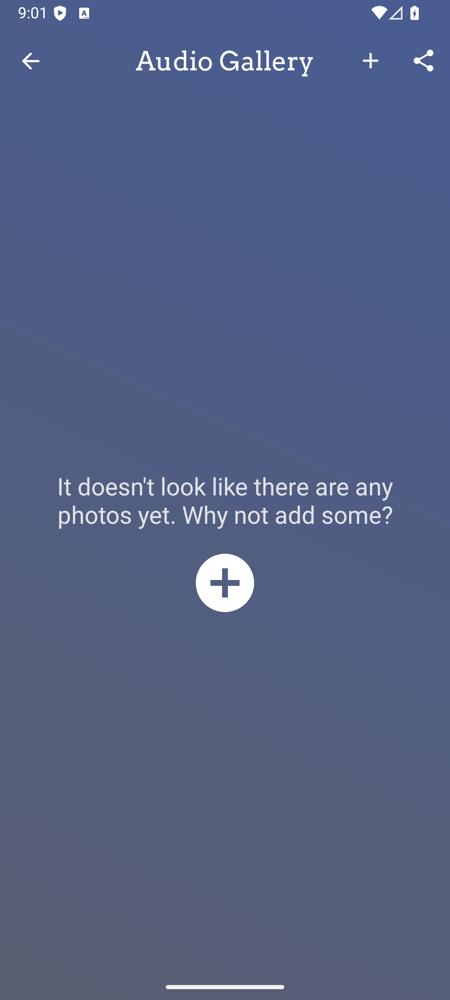
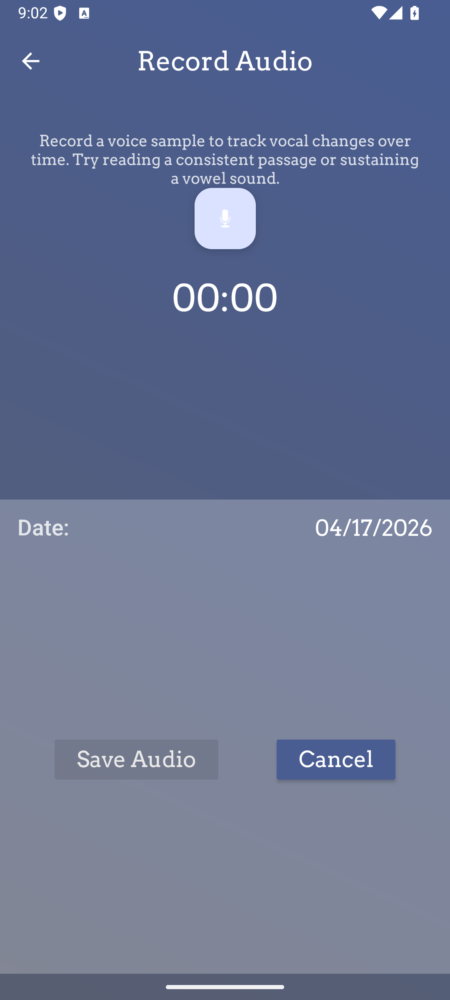

# OpenTransition

OpenTransition is a private, secure photo-journal app for tracking a gender transition journey. It is the active successor to the original **TransTracks** app, which was [retired from the Google Play Store in 2025](https://github.com/TransTracks/TransTracks-Android). If you were a TransTracks user, see [Importing from TransTracks](#-importing-from-transtracks) below.

> 🙏 **Standing on the shoulders of TransTracks.** OpenTransition exists because of the years of work that **Cassie Wilson** poured — single-handedly — into building [TransTracks](https://github.com/TransTracks/TransTracks-Android), a private, transition-focused journal app. We are deeply grateful for her contribution and we honor her GPL-3.0 license by keeping this fork — and every modification to it — free and open under the same terms. See [Acknowledgments](#-acknowledgments) and [Credits](#credits) for the full attribution.

## Table of Contents

- [Multi-Platform Support](#-multi-platform-support)
- [Documentation](#-documentation)
- [Screenshots](#-screenshots)
- [Key Features](#-key-features)
- [Tech Stack](#-tech-stack)
- [Architecture](#️-architecture)
- [Project Structure](#-project-structure)
- [Getting Started](#-getting-started-for-development)
- [Package Information](#-package-information)
- [Importing from TransTracks](#-importing-from-transtracks)
- [Contributing](#-contributing)
- [Acknowledgments](#-acknowledgments)
- [License](#license)
- [Credits](#credits)

## 📱 Multi-Platform Support

This repository is organized as a **monorepo** containing multiple Android applications:

- 📱 **Mobile App** - Full-featured Android app for phones and tablets
- ⌚ **Wear OS App** - Companion app for Android smartwatches
- 🔗 **Shared Module** - Common code and data models for communication

The mobile and Wear OS apps communicate using Google's Wearable Data Layer API, allowing you to:
- Trigger photo capture from your smartwatch
- View recent milestones on your wrist
- Receive notifications on your watch

**See [MONOREPO.md](MONOREPO.md) for detailed information about the monorepo structure and inter-app communication.**

## 📚 Documentation

**Complete documentation is available at:** [**https://shelbeely.github.io/OpenTransition**](https://shelbeely.github.io/OpenTransition)

### For Users

- 📱 [User Guide](https://shelbeely.github.io/OpenTransition/user-guide/getting-started/) - Learn how to use the app
- ❓ [FAQ](https://shelbeely.github.io/OpenTransition/user-guide/faq/) - Frequently asked questions
- 🎨 [Features Overview](https://shelbeely.github.io/OpenTransition/user-guide/features/) - Discover what the app can do
- 🔒 [Privacy & Security](https://shelbeely.github.io/OpenTransition/user-guide/privacy/) - Learn about data protection

### For Developers

- 🚀 [Getting Started](https://shelbeely.github.io/OpenTransition/getting-started/overview/) - Set up your development environment
- 🏗️ [Architecture](https://shelbeely.github.io/OpenTransition/architecture/overview/) - Understand the app structure
- 🧪 [Development Guide](https://shelbeely.github.io/OpenTransition/development/code-style/) - Coding standards and practices
- 🤝 [Contributing](https://shelbeely.github.io/OpenTransition/contributing/guidelines/) - How to contribute to the project

## 📸 Screenshots

<!-- SCREENSHOTS-START -->
> 🤖 **Auto-generated** — refreshed by CI on every push to `production`.  Captured on a `medium_phone` emulator (API 36, debug build).

| | | |
|:---:|:---:|:---:|
|  |  |  |
| **Home** | **Settings** | **Milestones** |
|  |  |  |
| **Face Gallery** | **Audio Gallery** | **Record Audio** |

[📂 View all 16 screenshots →](screenshots/README.md)
<!-- SCREENSHOTS-END -->

## ✨ Key Features

- 📸 **Photo Tracking** - Document your transition with organized photos (face, body, custom areas)
- 📸 **Face-Detection Camera** - CameraX-powered camera with ML Kit face detection for perfectly framed face photos
- 🎯 **Milestone Management** - Record and celebrate important events
- 🖼️ **Gallery View** - Browse and compare your progress photos
- 🎙️ **Audio Tracking** (preview) — Record voice samples and revisit them over time. Pitch and formant values displayed alongside recordings are currently typical estimates rather than measurements of your audio; on-device DSP analysis is planned for a future release. See [ISSUE-005](audit-report/07-issues-and-bugs.md#issue-005--correctness-mobile).
- 🔒 **Privacy First** - App lock (PIN, pattern, or biometric), disguised mode, and local storage
- 🔐 **Optional Encryption** - Encrypt your database with SQLCipher (optional)
- 🎭 **Decoy Vault** - Create a separate vault with different passcode for added security
- 💾 **Data Control** - Export, backup, and sync on your terms
- 🔄 **Import Backups** - Import `.ttbackup` data from the original TransTracks app
- 🎨 **Customizable** - Multiple themes and personalization options
- ⌚ **Wear OS Companion** - Trigger photo capture and view milestones from your smartwatch

## 🛠️ Tech Stack

| Layer | Technology |
|---|---|
| **Language** | Kotlin 2.0.20 |
| **UI** | Jetpack Compose (Material Design 3) + XML Views (incremental migration) |
| **Navigation** | Jetpack Navigation Component 2.8.5 with SafeArgs |
| **Async** | Kotlin Coroutines + Flow; RxJava 3 + RxRelay (legacy, being phased out) |
| **Database** | Room 2.6.1 + SQLCipher 4.5.4 (optional encryption); Realm 2.3.0 (read-only, for TransTracks import) |
| **Image loading** | Coil 3 |
| **Camera** | CameraX 1.3.1 |
| **Face detection** | ML Kit Face Detection 16.1.6 |
| **Auth / Security** | Firebase Auth, Biometric API, EncryptedSharedPreferences |
| **Cloud** | Firebase (Analytics, Crashlytics, Firestore, Auth) |
| **Ads** | Google Mobile Ads (AdMob) 22.4.0 |
| **Wear communication** | Wearable Data Layer API (play-services-wearable 18.1.0) |
| **Build** | AGP 8.13.0, Gradle wrapper, KSP 2.0.20-1.0.25 |
| **CI/CD** | GitHub Actions (debug builds, release bundles, UI screenshots, docs) |
| **Distribution** | Fastlane → Google Play Store |

## 🗂️ Project Structure

```
OpenTransition/
├── mobile/                    # Phone/tablet app (main application)
│   ├── src/main/java/com/shelbeely/opentransition/
│   │   ├── ui/                # Screens, fragments, Compose UI
│   │   ├── data/              # Data models and repositories
│   │   ├── domain/            # Business logic
│   │   ├── background/        # Background tasks and workers
│   │   └── wear/              # Wearable listener service
│   ├── src/main/res/          # Layouts, drawables, strings
│   ├── src/test/              # Unit tests
│   ├── src/androidTest/       # Instrumented tests
│   ├── schemas/               # Room schema export files
│   └── build.gradle
│
├── wear/                      # Wear OS companion app
│   ├── src/main/java/com/shelbeely/opentransition/wear/
│   │   ├── MainActivity.kt
│   │   └── WearableListenerService.kt
│   └── build.gradle
│
├── shared/                    # Pure-Kotlin library shared by mobile + wear
│   ├── src/main/java/com/shelbeely/opentransition/shared/
│   │   ├── WearableConstants.kt
│   │   └── models/            # Data models for cross-device sync
│   └── build.gradle
│
├── .github/
│   ├── workflows/             # CI: debug builds, release, screenshots, docs
│   └── actions/               # Reusable composite actions
├── fastlane/                  # Play Store deployment configuration
├── docs/                      # MkDocs source for GitHub Pages docs site
├── screenshots/               # Auto-captured UI screenshots (updated by CI)
├── keys/                      # Debug keystore (safe to commit); release injected by CI
├── audit-report/              # Known issues and technical debt tracking
├── build.gradle               # Root build script (versions, classpath)
├── settings.gradle            # Module declarations
├── secrets.properties.example # Template — copy to secrets.properties
└── README.md
```

## 🔄 Importing from TransTracks

**TransTracks was retired from the Google Play Store in 2025.** If you were a TransTracks user, OpenTransition is the recommended way to continue your journey. It is fully compatible with the `.ttbackup` backup format that TransTracks produces.

### How to get your data out of TransTracks

If you still have TransTracks installed on your phone:

1. Open TransTracks
2. Go to **Settings → Export**
3. The app will bundle everything into a `.ttbackup` file and open the Android share sheet
4. Save it somewhere safe (Google Drive, email, Files app, etc.)

The `.ttbackup` file is a standard ZIP archive with a custom extension — you can rename it to `.zip` to inspect its contents on a computer.

If you have already uninstalled TransTracks but used the same Google account, you may still be able to reinstall it from the Play Store under **Manage apps and device → Manage → Not installed**. Android auto-backup usually restores the data.

### Importing into OpenTransition

1. Locate your `.ttbackup` file
2. Tap it to open it with OpenTransition (or go to Settings → Import Backup)
3. Confirm the import
4. Wait for the import to complete — all photos, milestones, and metadata are preserved

### Technical Details

OpenTransition uses **Room database** instead of the Realm database used by the original TransTracks. Backwards-compatible import utilities handle the conversion automatically:

- **Realm data models preserved** — used only for reading TransTracks backups
- **Automatic conversion** from Realm to Room format during import
- **No data loss** — all photos, milestones, and audio analyses are preserved
- **One-time process** — after import, everything runs on the Room database

All Realm-related code is marked with `BACKWARDS COMPATIBILITY` comments.

See [ENCRYPTED_DATABASE.md](ENCRYPTED_DATABASE.md) for details on the database architecture and optional SQLCipher encryption.

## 🚀 Getting Started for Development

### Prerequisites

| Requirement | Notes |
|---|---|
| **JDK 17** | Required by AGP 8 / Kotlin 2.0.20 |
| **Android Studio** *Ladybug* or newer | Recommended for IDE support |
| **Android SDK** | `compileSdk 36`, `targetSdk 35`, `minSdk 26` |
| **Firebase project** | Needed for Crashlytics, Auth, and Firestore |

### One-time setup

```bash
# 1. Clone
git clone https://github.com/shelbeely/OpenTransition.git
cd OpenTransition

# 2. Point Gradle at your Android SDK
echo "sdk.dir=$ANDROID_SDK_ROOT" > local.properties

# 3. Stub secrets (safe test AdMob IDs are already filled in)
cp secrets.properties.example secrets.properties

# 4. Place your Firebase google-services.json in the mobile/ folder
#    (download from Firebase Console → Project settings → Your apps)

# 5. Make the wrapper executable
chmod +x ./gradlew
```

> ⚠️ **Never commit** `secrets.properties`, `local.properties`, or a real
> `mobile/google-services.json`. They are listed in `.gitignore`; CI injects
> production values from GitHub Secrets.

### Build commands

```bash
# Debug APK (mobile)
./gradlew :mobile:assembleDebug

# Debug APK (Wear OS)
./gradlew :wear:assembleDebug

# All modules
./gradlew build

# Unit tests
./gradlew test

# Instrumented tests (requires running emulator or device)
./gradlew :mobile:connectedDebugAndroidTest

# Lint
./gradlew :mobile:lintDebug :wear:lintDebug

# Install on connected device/emulator
./gradlew :mobile:installDebug
```

Append `--stacktrace` when diagnosing build failures.

**Full setup instructions:** [Development Setup Guide](https://shelbeely.github.io/OpenTransition/getting-started/development-setup/)

### Retrieving on-device crash logs

When the app crashes due to an uncaught exception (or an unhandled coroutine
failure), a plain-text report is written to the app's external files directory
so it can be retrieved without root access. Reports include the timestamp,
app/Android/device info, the crashing thread name and the full stack trace.

Pull all reports from a connected device with:

```bash
adb pull /sdcard/Android/data/com.shelbeely.opentransition/files/crash_logs/
```

You can also browse to that folder in the **Files** app on the device. The most
recent 20 reports are kept; older ones are deleted automatically.

## 📦 Package Information

### Mobile App
- **Package Name**: `com.shelbeely.opentransition`
- **App Name**: OpenTransition
- **Minimum SDK**: 26 (Android 8.0)
- **Target SDK**: 35

### Wear OS App
- **Package Name**: `com.shelbeely.opentransition.wear`
- **App Name**: OpenTransition
- **Minimum SDK**: 30 (Wear OS 3.0)
- **Target SDK**: 36

This fork uses a different package name to allow independent deployment

## 🤝 Contributing

We welcome contributions! If you'd like to help improve OpenTransition:

1. Check the [issues](https://github.com/shelbeely/OpenTransition/issues) for ideas
2. Read our [Contributing Guidelines](https://shelbeely.github.io/OpenTransition/contributing/guidelines/)
3. Fork the repository and make your changes
4. Submit a pull request

**Areas we need help with:**
- Bug fixes and testing
- Feature development
- Documentation improvements
- Translations/localization
- UI/UX improvements

## 👥 Contributors

We are grateful to everyone who has contributed to OpenTransition!

View the full, up-to-date list on [GitHub contributors](https://github.com/shelbeely/OpenTransition/graphs/contributors).

## 🙏 Acknowledgments

OpenTransition would not exist without the original **TransTracks** application — the work of a single developer, **Cassie Wilson** (`<contact@transtracks.app>`). Cassie wrote, maintained, and shipped TransTracks essentially on her own from 2018 to 2021, before the app was retired from the Google Play Store in 2025. Her source code remains archived at [github.com/TransTracks/TransTracks-Android](https://github.com/TransTracks/TransTracks-Android).

Cassie built — and freely shared, under GPL v3 — almost every foundational feature this app still relies on today: photo categorization, milestone tracking, the gallery and comparison views, the train-tracks privacy mode, the `.ttbackup` data format, and much more. **Thank you, Cassie.** Your work made it possible to keep this kind of app available to the trans community at a moment when it was about to disappear.

OpenTransition is the active continuation of that work, maintained independently by [Shelbeely](https://github.com/shelbeely) and the [OpenTransition contributors](https://github.com/shelbeely/OpenTransition/graphs/contributors), and licensed under the same GPL v3 to keep that chain unbroken.

For the full attribution, see [`NOTICE`](NOTICE), [`AUTHORS`](AUTHORS), and the in-app **Settings → About → Credits** screen.

## License

OpenTransition is a fork of TransTracks and maintains the same GPL v3 license. See [`LICENSE`](LICENSE) for the full license text, [`NOTICE`](NOTICE) for the attribution summary, and [`AUTHORS`](AUTHORS) for the lineage of authorship.

```
Original Copyright (C) 2018 - 2021 TransTracks (Cassie Wilson)
Fork modifications and rebranding (C) 2025 Shelbeely and OpenTransition contributors

This program is free software: you can redistribute it and/or modify
it under the terms of the GNU General Public License as published by
the Free Software Foundation, either version 3 of the License, or
(at your option) any later version.

This program is distributed in the hope that it will be useful,
but WITHOUT ANY WARRANTY; without even the implied warranty of
MERCHANTABILITY or FITNESS FOR A PARTICULAR PURPOSE.  See the
GNU General Public License for more details.

You should have received a copy of the GNU General Public License
along with this program.  If not, see <https://www.gnu.org/licenses/>.
```

## Credits

OpenTransition is based on the original **TransTracks** application, written single-handedly by **Cassie Wilson** (`<contact@transtracks.app>`). TransTracks was retired from the Google Play Store in 2025; its source code is archived at [github.com/TransTracks/TransTracks-Android](https://github.com/TransTracks/TransTracks-Android). We are deeply grateful to Cassie for creating this valuable tool for the transgender community and for releasing it under GPL v3 — her work provided the foundation that makes OpenTransition possible.

[Full Credits & Attribution →](https://shelbeely.github.io/OpenTransition/credits/)
