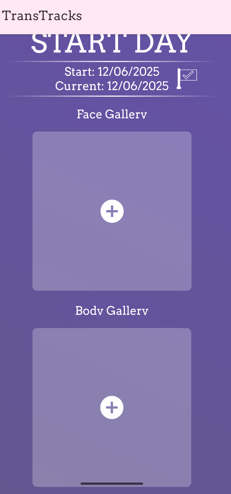

# OpenTransition Documentation



Welcome to the official documentation for **OpenTransition** - a transition tracking application specifically designed for transgender people, focusing on photo tracking and milestone management.

## What is OpenTransition?

OpenTransition is a customized fork of the original **TransTracks** application, rebranded and repackaged for independent deployment. It helps transgender individuals track their transition journey through photos and milestones, providing a private and secure way to document changes over time.

!!! info "Built on TransTracks"
    OpenTransition is based on the excellent work of the original TransTracks developers. We're grateful for their contribution to the transgender community. [Learn more about credits and attribution →](credits.md)

## Key Features

### 📸 Photo Tracking
Track your transition with photos organized by different body types (face, body). Compare photos side-by-side to see your progress over time.

### 🎤 Voice Tracking
Record audio samples to track voice changes throughout your transition. Automatic voice analysis provides formant frequencies (F1, F2, F3, F4) and pitch data (F0) to help you monitor vocal progress. Compare recordings over time with visualizations including waveforms, pitch progression charts, and formant plots.

### 🎯 Milestone Management
Record and celebrate important milestones in your transition journey. Track dates, add descriptions, and associate photos with specific achievements.

### 🖼️ Gallery View
Browse your transition photos and audio recordings in an organized gallery. Filter by date, type, and milestones to find exactly what you're looking for.

### 🔒 Privacy & Security
- App lock with PIN or pattern
- Disguised app icon (train mode)
- Secure local storage
- Optional cloud sync with Firebase

### 🎨 Customization
- Multiple theme options (Pink, Blue, Purple, Green)
- Flexible photo organization
- Custom milestone types

### 💾 Data Management
- Import/Export your data
- Firebase cloud backup
- Local Realm database

## Technology Stack

- **Language**: Kotlin
- **UI Framework**: Android SDK with Material Design
- **Database**: Realm Kotlin
- **Architecture**: MVVM with Domain layer
- **Navigation**: Android Navigation Component
- **Reactive Programming**: RxJava 3
- **Cloud Services**: Firebase (Auth, Firestore, Analytics, Crashlytics)
- **Build System**: Gradle

## Quick Links

- [Getting Started](getting-started/overview.md) - Set up your development environment
- [Architecture Overview](architecture/overview.md) - Understand the app structure
- [Contributing Guidelines](contributing/guidelines.md) - Learn how to contribute
- [Features Documentation](features/photo-tracking.md) - Explore all features in detail

## Community & Support

- 🐛 [Report Issues](https://github.com/shelbeely/OpenTransition/issues)
- 💡 [Feature Requests](https://github.com/shelbeely/OpenTransition/issues/new)
- 🤝 [Contributing](contributing/guidelines.md)
- 🏆 [Credits & Attribution](credits.md)

## License

OpenTransition is free and open-source software licensed under the GNU General Public License v3.0.

```
Original Copyright (C) 2018 - 2021 TransTracks
Fork modifications and rebranding by the OpenTransition contributors

This program is free software: you can redistribute it and/or modify
it under the terms of the GNU General Public License as published by
the Free Software Foundation, either version 3 of the License, or
(at your option) any later version.
```

See the [LICENSE](https://github.com/shelbeely/OpenTransition/blob/main/LICENSE) file for more details.

## Project Information

- **Package Name**: `com.shelbeely.opentransition`
- **App Name**: OpenTransition
- **Minimum Android SDK**: 21 (Android 5.0)
- **Target Android SDK**: 36
- **Current Version**: 1.3.x
