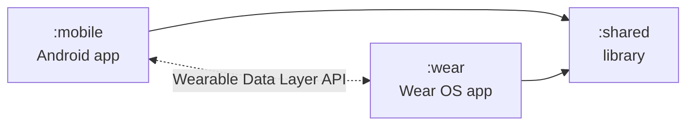
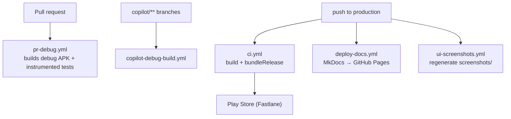

# Architecture

High-level architecture of the OpenTransition monorepo. This page summarizes and links to the canonical sources; it does not duplicate them.

**Canonical sources (read these for full detail):**

- [`ARCHITECTURE.md`](../../ARCHITECTURE.md) — monorepo + inter-app communication architecture
- [`MONOREPO.md`](../../MONOREPO.md) — monorepo guide
- [`audit-report/02-architecture-assessment.md`](../../audit-report/02-architecture-assessment.md) — internal audit
- [`audit-report/05-mobile-wear-integration.md`](../../audit-report/05-mobile-wear-integration.md) — mobile↔wear integration

## Module Boundaries

- `:mobile` and `:wear` both depend on `:shared`. They do **not** depend on each other.
- Cross-app communication uses Google's **Wearable Data Layer API** (`com.google.android.gms:play-services-wearable:18.1.0`), declared in both `:wear` and `:shared`. The full message-path / data-item / helper contract is documented in [`apis/wearable-data-layer.md`](./apis/wearable-data-layer.md).
- Shared code in `:shared` consists of three Kotlin sources: `WearableConstants.kt` (message paths + keys), `models/MilestoneData.kt` (`@Parcelize` DTO), and `util/WearableHelper.kt` (helper wrapping `MessageClient`/`DataClient`).

## Build & SDK Targets

Evidence: module `build.gradle` files.

| Module | `compileSdk` | `minSdk` | `targetSdk` |
|---|---|---|---|
| `:mobile` | 36 | 26 | 35 |
| `:wear` | 36 | 30 | 36 |
| `:shared` | 36 | 21 | 36 |

> ⚠️ The values above are taken **from the source `build.gradle` files**, which are the final authority. Some prose docs (e.g. `.github/copilot-instructions.md`) describe `:mobile` as `minSdk 21 / targetSdk 36`. See [`_state/unknowns.md`](./_state/unknowns.md) for the open question.

App version constants (`appMajor`, `appMinor`, `appBaseBuildNumber`, `getAppVersionCode`, `getAppVersionName`) are declared **once** in the root [`build.gradle`](../../build.gradle) and consumed by both `:mobile` and `:wear` so the two apps cannot drift. See [`audit-report/15-release-and-distribution.md`](../../audit-report/15-release-and-distribution.md) §6.

## UI Layer

- Migrating from XML Views + ViewBinding → Jetpack Compose. Both stacks coexist; use `ComposeView` / `AndroidView` interop.
- Material Design 3 via Compose BOM (see `mobile/build.gradle`).
- Navigation: Jetpack Navigation 2.8.5 + SafeArgs (gradle plugin classpath in root [`build.gradle`](../../build.gradle), plugin applied in [`mobile/build.gradle`](../../mobile/build.gradle)).
- Wear UI: Wear Compose Material/Foundation 1.4.1 (see [`wear/build.gradle`](../../wear/build.gradle)).

## Reactive / Async Layer

- Kotlin Coroutines + Flow are the preferred primitives.
- RxJava 3 + RxRelay + RxBinding are present and being phased out.
- `kotlinx-coroutines-rx3` provides the bridge during migration.
- See [`.github/skills/migration/rxjava-to-coroutines-migration/SKILL.md`](../../.github/skills/migration/rxjava-to-coroutines-migration/SKILL.md) for the migration playbook.

## Persistence Layer

- **Primary local DB:** Room 2.6.1 with KSP-generated code. Schemas exported to `mobile/schemas/` (KSP arg `room.schemaLocation`). See [`audit-report/07-issues-and-bugs.md`](../../audit-report/07-issues-and-bugs.md) ISSUE-006.
- **Encryption:** Optional SQLCipher 4.5.4 (`net.zetetic:android-database-sqlcipher`). Documented in [`ENCRYPTED_DATABASE.md`](../../ENCRYPTED_DATABASE.md).
- **Realm:** Realm Kotlin SDK 2.3.0 retained read-only for importing legacy `.ttbackup` archives from TransTracks. The Realm Gradle plugin is declared at the root and applied as needed.
- **Secure key storage:** `androidx.security:security-crypto` (EncryptedSharedPreferences) and the Biometric API.

## Authentication & Security

- Firebase Auth (initialised via the `com.google.gms.google-services` plugin and `mobile/google-services.json`).
- App lock: PIN, pattern, biometric (Biometric API).
- Disguised mode and decoy vault — see [`README.md`](../../README.md) Key Features.
- Full risk map: [Security & Risk](./security-and-risk.md).

## Cloud Services

- **Firebase**: Auth, Crashlytics, Firestore, Analytics. Crashlytics is **disabled in debug** (`mobile/build.gradle` block: `android.buildTypes.debug.ext.enableCrashlytics = false`).
- **AdMob** (`com.google.android.gms:play-services-ads`) — IDs supplied via `secrets.properties`. Test IDs ship in `secrets.properties.example`.

## Configuration Entry Points

- Build/Gradle: root [`build.gradle`](../../build.gradle), `gradle.properties`.
- Per-app: `mobile/build.gradle`, `wear/build.gradle`, `shared/build.gradle`.
- Secrets: `secrets.properties` (generated), `mobile/google-services.json` (generated).
- Signing: `keys/debug-keystore.jks` (committed); release keystore injected via CI secret `KEYSTORE_64`.
- See [Configuration](./configuration.md).

## CI/CD Entry Points

- See [Workflows](./workflows/index.md) for one page per `.github/workflows/*.yml`.
- The deploy path lives in [`.github/workflows/ci.yml`](../../.github/workflows/ci.yml) (push to `production` → Play Store via Fastlane supply).

## Diagram: Build & Deploy Flow

## What This Page Does Not Cover (yet)

- Per-feature data flows (camera, encryption setup, Wear pairing) — deferred to feature pages under [`features/`](./features/index.md).
- Detailed Room entity/DAO map — deferred to [`data/index.md`](./data/index.md).
- Detailed UI component graph — deferred to [`components/index.md`](./components/index.md).
