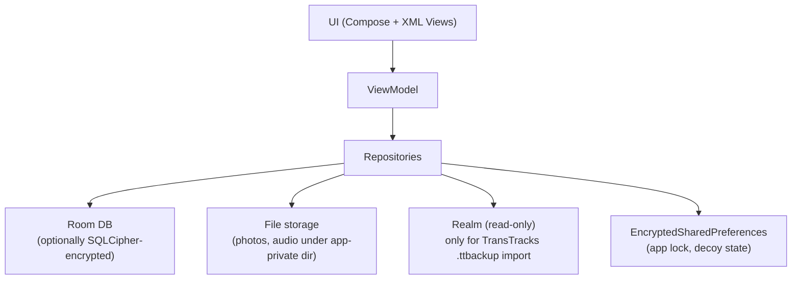
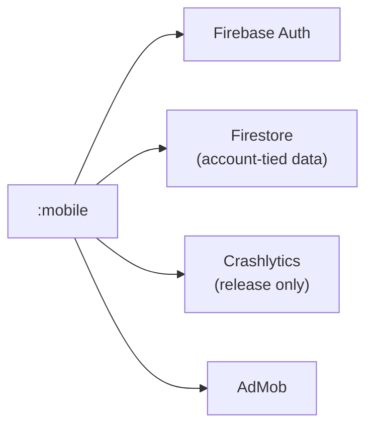
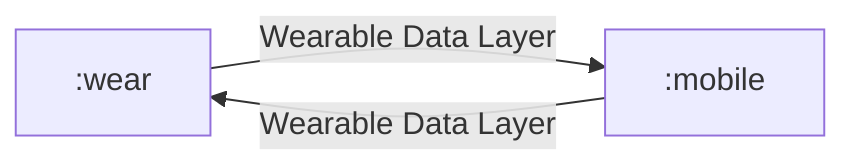

# Data Flow

Pass-1 sketch of how data moves through OpenTransition. **Status: Partial.** Detailed per-feature flows are deferred to `features/` pages.

## Local Data Stores

Sources of truth: [`mobile/build.gradle`](../../mobile/build.gradle), [`ENCRYPTED_DATABASE.md`](../../ENCRYPTED_DATABASE.md), [`ARCHITECTURE.md`](../../ARCHITECTURE.md). Schemas exported to `mobile/schemas/`.

## Cloud Boundaries

- Crashlytics is **disabled in debug** — see [`build-and-release.md`](./build-and-release.md).
- Firebase configuration enters via [`mobile/google-services.json`](../../mobile/) (CI-injected; dummy in dev).
- AdMob IDs enter via `secrets.properties` (test IDs in dev).

## Mobile ↔ Wear

- Message paths and serialized models are defined in [`shared/src/main/java/com/shelbeely/opentransition/shared/`](../../shared/src/main/java/com/shelbeely/opentransition/shared/) (`WearableConstants.kt`, `models/MilestoneData.kt`), and the wire helpers in `util/WearableHelper.kt`. Full contract: [`apis/wearable-data-layer.md`](./apis/wearable-data-layer.md).
- Both modules pull `com.google.android.gms:play-services-wearable:18.1.0` to talk to the Wearable API.
- See [`audit-report/05-mobile-wear-integration.md`](../../audit-report/05-mobile-wear-integration.md) for the integration audit.

## Build-Time → Runtime

- Version constants flow root [`build.gradle`](../../build.gradle) → `BuildConfig` (BuildConfig generation is on per [`gradle.properties`](../../gradle.properties)).
- Secrets flow `secrets.properties` → Gradle → `BuildConfig` / resource fields → runtime.
- Firebase config flows `mobile/google-services.json` → `com.google.gms.google-services` plugin → generated values → runtime.

## Open Items

- Detailed Room entity/DAO/Migration map → not yet documented. Track in [`data/index.md`](./data/index.md).
- Camera capture pipeline → defer to a `features/photo-capture.md` page (not yet written).
- TransTracks import pipeline (`Realm` → Room) → defer to a `features/import.md` page (not yet written).
