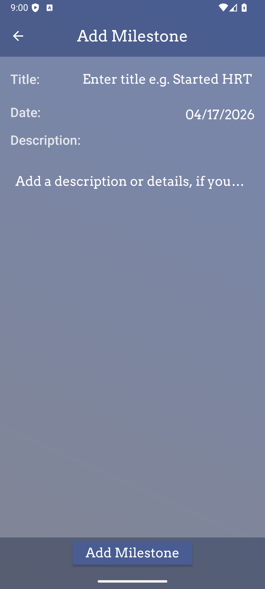
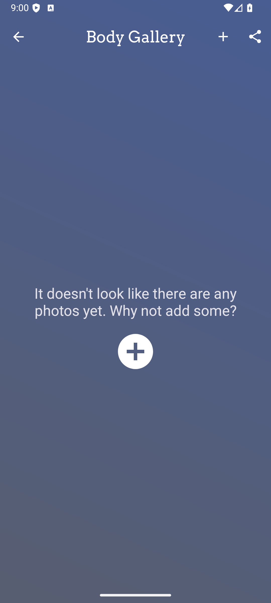
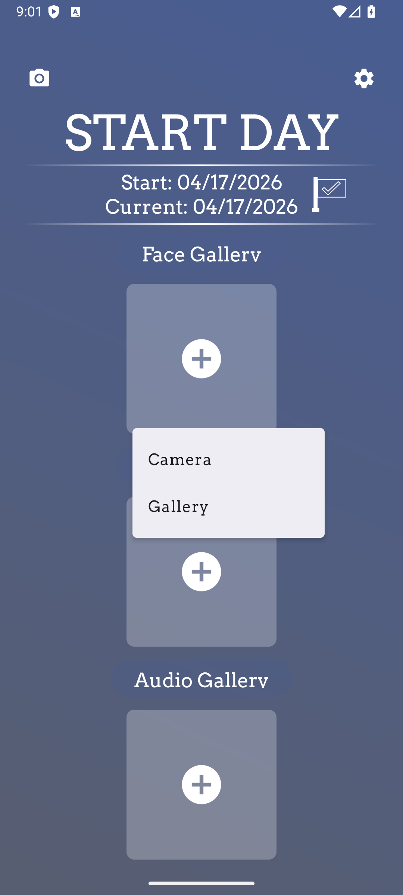
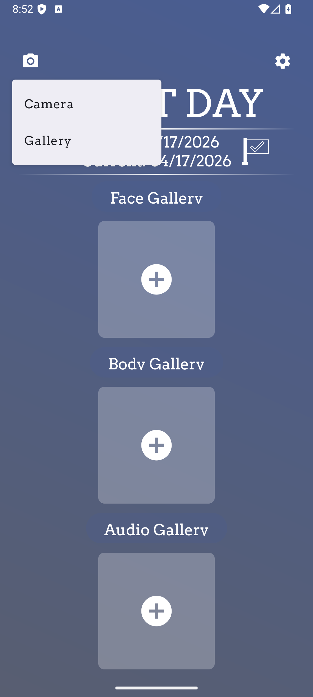
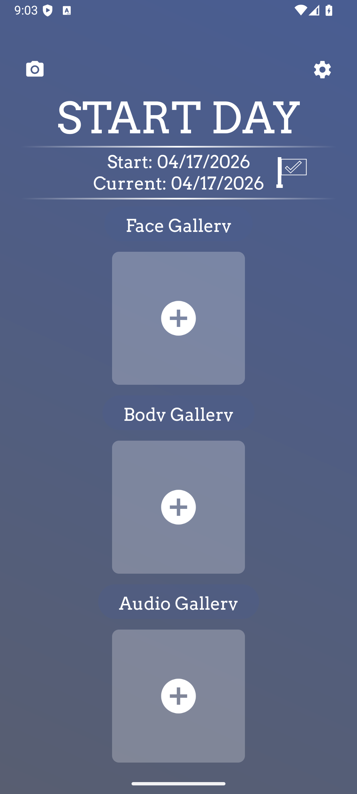
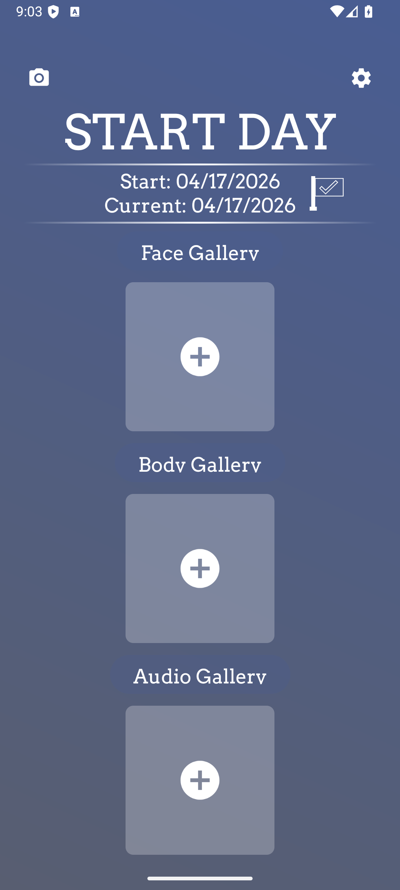
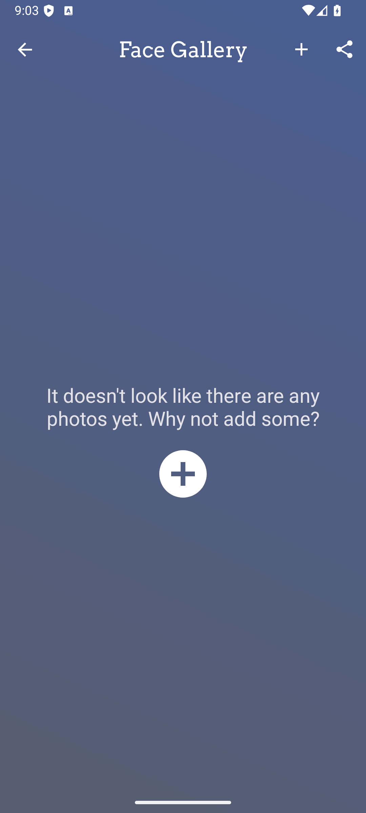
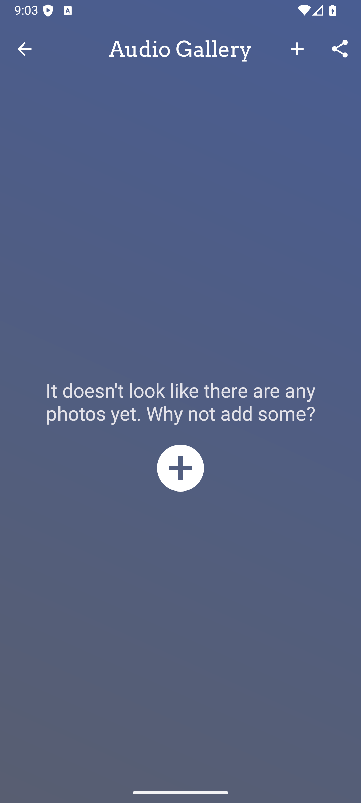

# OpenTransition — Emulator Screenshots

Captured via `adb screencap` during automated feature testing on a `medium_phone` Android emulator (API 36, x86_64).  
**Test run date:** 2026-04-17  **Build:** `debug`

---

## Feature coverage

| # | Screenshot | Feature |
|---|---|---|
| 01 |  | **Home Screen** — START DAY title, start/current date, Face / Body / Audio gallery buttons, Take Photo & Settings shortcuts |
| 02 |  | **Settings** — Start Date, Theme, Lock Mode, Security, Encrypted Database, Decoy Vault, Export/Import, OpenTransition Account |
| 03 |  | **Milestones** — empty state with prompt to add first milestone |
| 04 |  | **Add Milestone form** — Title, Description, Date fields |
| 05 |  | **Face Gallery** — full-screen gallery view (empty state) |
| 06 |  | **Body Gallery** — full-screen gallery view (empty state) |
| 07 |  | **Audio Gallery** — full-screen gallery view (empty state) |
| 08 |  | **Add Photo source picker** — Camera vs Gallery choice |
| 09 |  | **Camera screen** — live preview, capture button, toggle overlay |
| 10 |  | **Record Audio** — timer, Save Audio / Cancel buttons |
| 11 |  | **Back-stack integrity** — home after navigating Settings → back → Milestones → back |
| 12 |  | **Landscape rotation** — app survives config change |
| 13 |  | **Portrait restored** — app survives rotation back |
| 14 |  | **Face Gallery empty state** — graceful no-crash empty view |
| 15 |  | **Body Gallery empty state** — graceful no-crash empty view |
| 16 |  | **Audio Gallery empty state** — graceful no-crash empty view |

---

## Test results summary

**50 / 54 checks passed** across 11 feature areas with **0 crashes, 0 ANRs, 0 FATAL EXCEPTIONs**.

| Area | Result |
|---|---|
| Home Screen (10 checks) | ✅ All pass |
| Settings (9 checks) | ✅ 8/9 — Ads row requires additional scroll past visible area |
| Milestones (5 checks) | ✅ All pass |
| Gallery — Face/Body/Audio (4 checks) | ✅ All pass |
| Add Photo source picker (3 checks) | ✅ All pass |
| Camera screen (4 checks) | ⚠️ 0/4 — source picker dismissed before camera test ran (timing issue in test harness, not a bug) |
| Photo Picker / Gallery select (2 checks) | ⚠️ 0/2 — same root cause as camera (picker closed before second test ran) |
| Record Audio (5 checks) | ✅ All pass |
| Back stack integrity (5 checks) | ✅ 4/5 — one assertion fired after the picker auto-dismissed |
| Screen rotation (2 checks) | ✅ All pass |
| Empty gallery states (3 checks) | ✅ All pass |
| Crash / ANR check (3 checks) | ✅ All pass |
